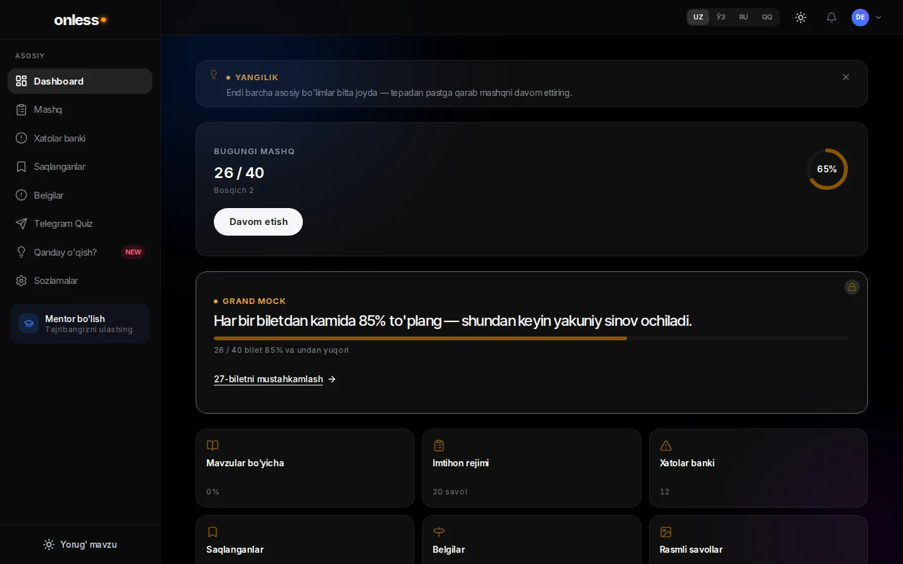
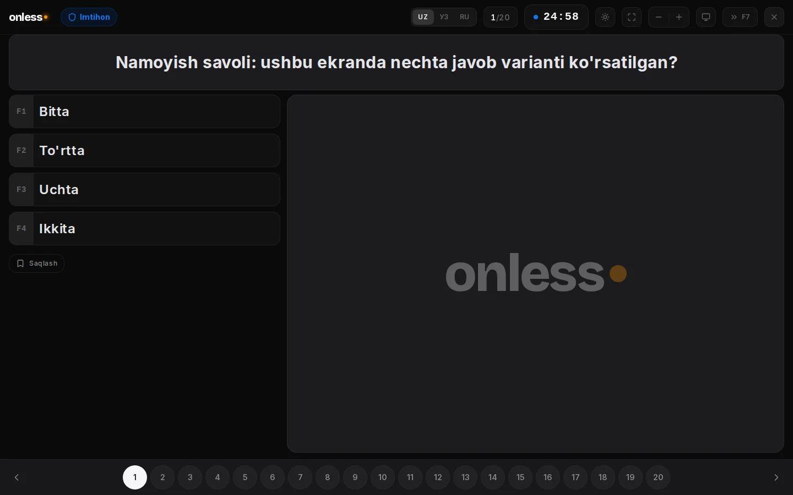
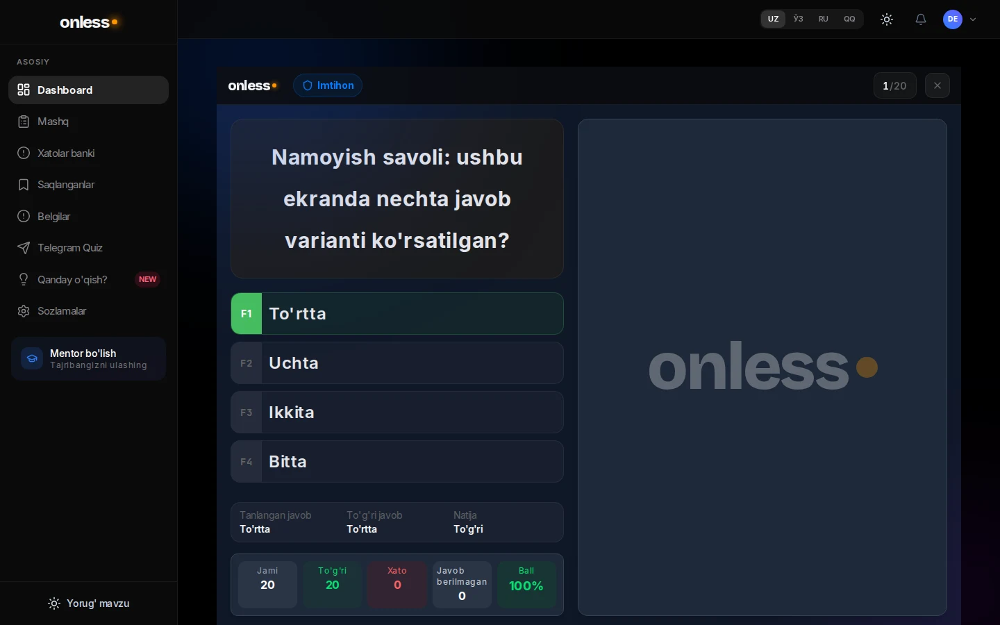
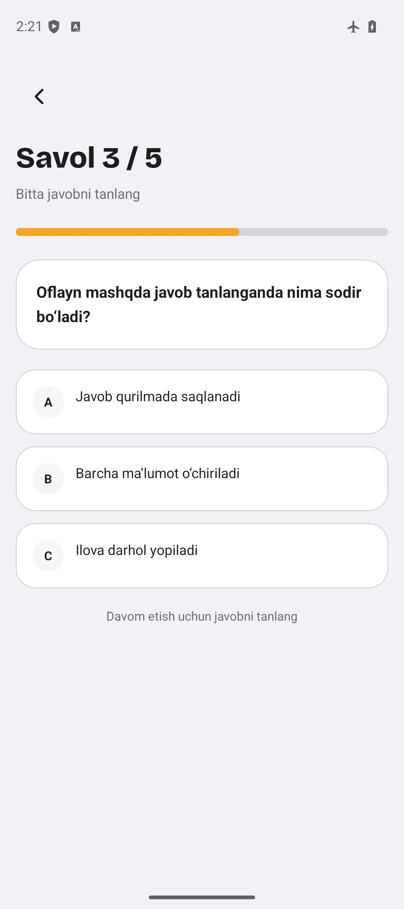
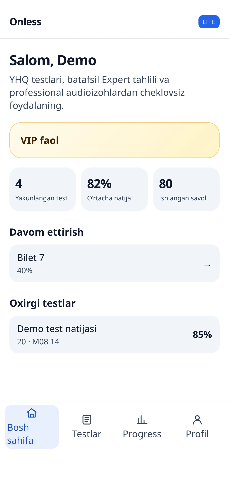
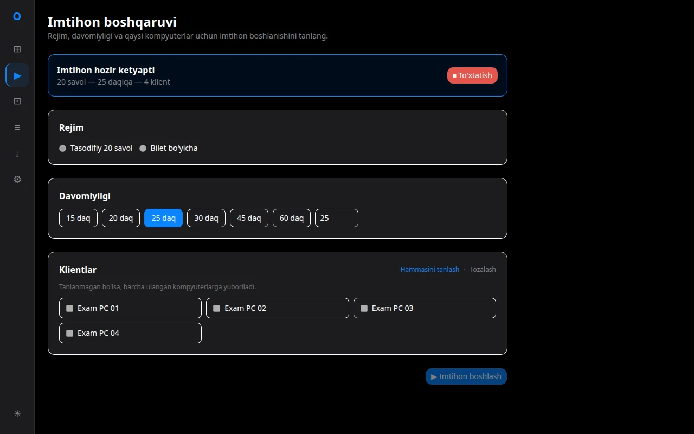

# Onless — President Tech Awards technical showcase

Onless helps learners preparing in Uzbek or Russian for Uzbekistan's road-rules theory exam (`YHQ` / `ПДД`). Practice, progress, exam results, and the next study step are often fragmented; Onless turns them into one learning loop: measure the current state, show a clear roadmap, keep practice available offline, explain the result, and continue on the most suitable client.

```text
evidence → roadmap → practice/exam → review → next evidence
```

The complete product supports web, native mobile, Telegram Lite, and classroom desktop experiences. This public repository contains five larger, runnable or independently testable engineering slices from that journey—not a production deployment or a directory dump.

> **President Tech Awards — full repository access / to‘liq repository’ga kirish**
>
> **O‘zbekcha:** To‘liq xususiy repository `onlessV2` nomi bilan yuritiladi. President Tech Awards nomidan kirish so‘rash uchun `s.yoqubov@onless.uz` manziliga yozing. Xatda to‘liq ismingiz, PTA reviewer rolingiz yoki vakolatingiz va GitHub username’ingizni ko‘rsating. Onless so‘rovni PTA tasdiqlagan aloqa kanali orqali tekshirgach, ko‘rsatilgan GitHub akkauntiga access beradi.
>
> **English:** The complete private repository is maintained as `onlessV2`. President Tech Awards reviewers may request access by emailing `s.yoqubov@onless.uz` with their full name, PTA reviewer role or authorization, and GitHub username. After Onless verifies the request through a PTA-authorized contact channel, access will be granted to that GitHub account.

## Product UI evidence

The images below are real checked-in interfaces from the complete private product, rendered with deterministic synthetic boundary data. They are not screenshots of the smaller public slices. Every final image passed an independent per-image visual gate of at least 4.5/5 and a privacy/trust gate of 1.0/1.0. Full hashes, runtimes, routes, network ledgers, and capture constraints are in the [evidence register](docs/screenshots/README.md).

| Student journey | Exam experience |
| --- | --- |
|  **Outcome:** progress and the next practice action stay visible together. |  **Outcome:** timer, choices, save action, and navigation keep one attempt focused. |
|  **Outcome:** selected/correct feedback turns a result into a review step. |  **Outcome:** an invented exercise remains usable with the emulator fully offline. |
|  **Outcome:** daily progress and recent results fit a compact read-only surface. |  **Outcome:** an operator sees exam state across four synthetic classroom PCs without device addresses. |

## Five curated engineering slices

| Slice | What a reviewer can inspect and verify | Location |
| --- | --- | --- |
| Web product journey | A fixture-only React/Vite presentation, bounded untrusted review-snapshot normalization, answer resolution, API-shaped roadmap parsing, and accessible roadmap/review views | [`apps/web`](apps/web) |
| API learning boundary | A stateless FastAPI route over a pure roadmap projection, capability-minimal evidence port, deterministic fixture source, bounded structural redaction, safe diagnostic events, and server-owned request correlation | [`services/api`](services/api) |
| Mobile offline engine | Durable-before-network answer confirmation, per-session ordering, bounded full-jitter retry, conflict reconciliation, cancellation barriers, asset preparation/self-heal, cleanup, and owner transitions behind narrow ports | [`apps/mobile`](apps/mobile) |
| Telegram Lite dashboard | A runnable read-only Mini App-style React/Vite dashboard with stale-request suppression, resume refresh, validated fixtures, localized copy, accessible loading/error states, and a zero-network boundary | [`apps/telegram-lite`](apps/telegram-lite) |
| Desktop exam domain | Shared exam/session validation and wire mapping in Rust and TypeScript, bilingual mode copy, Russian plural rules, and cross-language fixture parity—without LAN, device-control, or licensing code | [`apps/desktop-protocol`](apps/desktop-protocol) |

The review surface contains 9,238 physical lines of implementation across 60 source files and 7,846 lines of behavioral tests across 32 test files. The [architecture](docs/architecture.md), [public boundary](docs/public-scope.md), and [source provenance](docs/provenance.md) explain why each closure is present and what was deliberately removed.

## Run the local showcase

Prerequisite: Docker with Compose v2. No credentials or production service are required.

```bash
docker compose -f deploy/compose.yml up --build --wait
```

Open:

- Runnable Web journey: <http://localhost:8080>
- API liveness: <http://localhost:8000/health/live>
- Synthetic roadmap projection: <http://localhost:8000/demo/learning-roadmap>

The Web container serves the checked-in `apps/web` production build. The API is a separate, stateless synthetic boundary; the browser does not call it, and the containers do not share a network. Published ports bind only to `127.0.0.1`. Stop the demonstration with:

```bash
docker compose -f deploy/compose.yml down
```

To preview the independent Telegram Lite fixture UI instead:

```bash
npm --prefix apps/telegram-lite ci
npm --prefix apps/telegram-lite run dev -- --port 4174
```

Then open <http://127.0.0.1:4174>. This preview uses only the checked-in `Demo` data source and makes no API request.

## Verify every slice

CI uses Node.js `22.17.1`, Python `3.12.11`, Poetry `2.2.1`, and Rust `1.88.0`. Run from the repository root:

```bash
npm --prefix apps/web ci
npm --prefix apps/web run lint
npm --prefix apps/web run typecheck
npm --prefix apps/web test
npm --prefix apps/web run build

npm --prefix apps/mobile ci
npm --prefix apps/mobile run lint
npm --prefix apps/mobile run typecheck
npm --prefix apps/mobile test -- --runInBand

npm --prefix apps/telegram-lite ci
npm --prefix apps/telegram-lite run lint
npm --prefix apps/telegram-lite run typecheck
npm --prefix apps/telegram-lite test
npm --prefix apps/telegram-lite run build

cargo fmt --manifest-path apps/desktop-protocol/rust/Cargo.toml --check
cargo clippy --manifest-path apps/desktop-protocol/rust/Cargo.toml --all-targets -- -D warnings
cargo test --manifest-path apps/desktop-protocol/rust/Cargo.toml
npm --prefix apps/desktop-protocol/typescript ci
npm --prefix apps/desktop-protocol/typescript run lint
npm --prefix apps/desktop-protocol/typescript run typecheck
npm --prefix apps/desktop-protocol/typescript test

cd services/api
poetry install --with dev --no-interaction
poetry run ruff format --check src tests
poetry run ruff check src tests
poetry run mypy src
poetry run pytest -q
cd ../..

docker compose -f deploy/compose.yml config --quiet
```

GitHub Actions preserves eleven protected checks covering all language suites and production UI builds, API-to-Web roadmap fixture parity, container composition and image scanning, full-history Gitleaks/TruffleHog scanning, dependency scanning, and JavaScript/TypeScript, Python, and Actions CodeQL analysis. CI does not deploy or access private infrastructure.

## Scope and license

This is a curated technical showcase. It intentionally excludes production composition, authentication, payments, anti-cheat and question selection, question/lesson corpora, user/customer data, Telegram trust/bootstrap code, desktop networking and privileged device operations, production configuration, and private Git history. All runnable data is synthetic or local.

Public availability does not make this repository open source. Review the [source-available showcase license](LICENSE) before using the code, and report potential vulnerabilities privately as described in [SECURITY.md](SECURITY.md).
