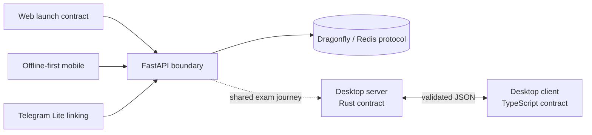

# Onless — President Tech Awards technical showcase

Onless is a multi-platform learning and exam system designed to keep one exam journey consistent across web, mobile, desktop, and Telegram experiences. This public repository contains a deliberately small, reviewable selection of engineering boundaries from the private product: typed launch contracts, offline-first command ordering, an atomic API lease, a cross-language desktop protocol, and a generation-safe Telegram Lite state machine.

> **President Tech Awards — full repository access / to‘liq repository’ga kirish**
>
> **O‘zbekcha:** To‘liq xususiy repository `onlessV2` nomi bilan yuritiladi. President Tech Awards nomidan to‘liq repository’ga kirish so‘rash uchun `s.yoqubov@onless.uz` manziliga yozing; xatda to‘liq ismingiz, PTA’dagi reviewer rolingiz yoki vakolatingiz va GitHub username’ingizni ko‘rsating. Onless so‘rovni PTA tasdiqlagan aloqa kanali orqali tekshirgach, ko‘rsatilgan GitHub akkauntiga access beradi.
>
> **English:** The complete private repository is maintained as `onlessV2`. President Tech Awards reviewers may request access by emailing `s.yoqubov@onless.uz` with their full name, PTA reviewer role or authorization, and GitHub username. After Onless verifies the request through a PTA-authorized contact channel, access will be granted to that GitHub account.

## What is included

| Boundary | Demonstrated engineering concern | Location |
| --- | --- | --- |
| Web | Runtime validation and type-safe exam launch/route identity | [`apps/web`](apps/web) |
| API | Atomic, user-scoped Redis focus leases with bounded TTLs | [`services/api`](services/api) |
| Mobile | Durable local commit-before-network ordering and owner isolation | [`apps/mobile`](apps/mobile) |
| Desktop server/client | Rust-authoritative wire schema with TypeScript parity fixtures | [`apps/desktop-protocol`](apps/desktop-protocol) |
| Telegram Lite | Explicit profile-linking states and stale-generation rejection | [`apps/telegram-lite`](apps/telegram-lite) |



The runnable local demo serves a newly authored static overview and a minimal FastAPI interface backed by Dragonfly. PostgreSQL is included to represent the product’s persistence boundary, but this curated API example intentionally stores no product or customer data. See [`docs/architecture.md`](docs/architecture.md) for the trust boundaries and design rationale.

## Run the local showcase

Prerequisites: Docker with Compose v2. No production credentials are required. Run all commands below from the repository root.

```bash
docker compose --env-file deploy/.env.example -f deploy/compose.yml up --build
```

Then open:

- Showcase page: <http://localhost:8080>
- API liveness: <http://localhost:8000/health/live>
- API readiness: <http://localhost:8000/health/ready>
- API documentation: <http://localhost:8000/docs>

Stop the stack and remove its local volumes:

```bash
docker compose --env-file deploy/.env.example -f deploy/compose.yml down --volumes
```

The sample ports are `5435` for PostgreSQL, `6382` for Dragonfly, `8000` for the API, and `8080` for the static showcase. PostgreSQL starts as an intentionally idle topology placeholder; the sample API does not connect to it or store product data. Values in [`deploy/.env.example`](deploy/.env.example) are local placeholders only. The `down --volumes` command permanently deletes the two local demonstration volumes.

## Verify each module

To match CI exactly, host-based checks use Node.js `22.17.1`, Python `3.12.11`, Poetry `2.2.1`, and Rust `1.88.0` with the `rustfmt` and `clippy` components. The package manifests accept compatible newer releases within their declared constraints, but the pinned CI versions are the reproducible baseline. Run these commands from the repository root:

```bash
npm --prefix apps/web ci
npm --prefix apps/web run lint
npm --prefix apps/web run typecheck
npm --prefix apps/web test

npm --prefix apps/mobile ci
npm --prefix apps/mobile run lint
npm --prefix apps/mobile run typecheck
npm --prefix apps/mobile test

npm --prefix apps/telegram-lite ci
npm --prefix apps/telegram-lite run lint
npm --prefix apps/telegram-lite run typecheck
npm --prefix apps/telegram-lite test

cargo fmt --manifest-path apps/desktop-protocol/rust/Cargo.toml --check
cargo clippy --manifest-path apps/desktop-protocol/rust/Cargo.toml --all-targets -- -D warnings
cargo test --manifest-path apps/desktop-protocol/rust/Cargo.toml
npm --prefix apps/desktop-protocol/typescript ci
npm --prefix apps/desktop-protocol/typescript run lint
npm --prefix apps/desktop-protocol/typescript run typecheck
npm --prefix apps/desktop-protocol/typescript test

cd services/api
poetry install --with dev
poetry run ruff format --check src tests
poetry run ruff check src tests
poetry run mypy src
poetry run pytest -q
cd ../..

docker compose --env-file deploy/.env.example -f deploy/compose.yml config --quiet
```

GitHub Actions runs the same language-level checks together with composition, secret, dependency, and code-scanning checks. It does not deploy software or use private infrastructure.

## Public-scope disclosure

This is a curated technical showcase, not the production repository and not a deployable copy of the Onless product. It contains no question bank, lesson corpus, user or customer data, production configuration, payment integration, private operational topology, anti-cheat implementation, application UI, or private Git history. The source paths and immutable source revisions used for the selected modules are documented in [`docs/provenance.md`](docs/provenance.md).

Public availability does not make this repository open source. Review the [showcase license](LICENSE) before using the code. Report potential vulnerabilities privately as described in [`SECURITY.md`](SECURITY.md).
