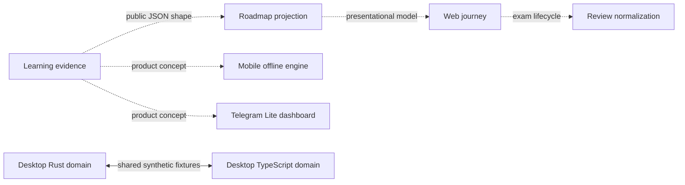
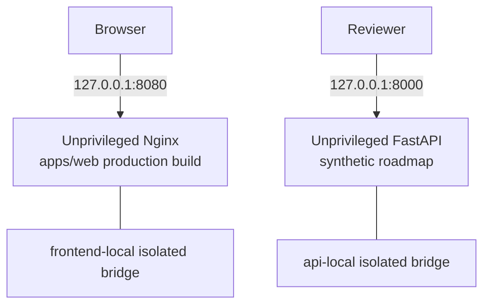

# Showcase architecture

## Design goal

This repository exposes five coherent, public-safe engineering slices of the Onless learning journey. Each slice keeps the same dependency direction:

```text
presentation → domain policy/validation → capability-minimal ports → local fixture adapter
```

Not every slice needs every layer. Pure parsers and cross-language domain models stop at the domain boundary; they do not gain empty abstractions merely to match the diagram. Production composition, persistence, authentication, payment, anti-cheat, content selection, Telegram trust/bootstrap, desktop networking, and device control remain private.

## Product-contract view

The dashed arrows below explain the conceptual product journey. They are not live connections in the public runtime.



The only cross-slice wire shape demonstrated between Web and API is `RoadmapProjection`: ordered stages containing `id`, `label`, `status`, and completed/total progress. Web rejects extra or malformed fields. CI serializes the projection from the current Python domain and structurally compares it with the fixture consumed by the Web tests, so drift fails without connecting the two runtime applications. The runnable Web app still uses that checked-in fixture; it does not call the API.

## Slice responsibilities and trust boundaries

### Web product journey

`apps/web` is a runnable React/Vite presentation. `showcase/app.tsx` composes the product loop, roadmap, and review views. The domain boundary validates untrusted review snapshots, safe local media paths, answer-resolution variants, and API-shaped roadmap projections before rendering. The production build contains no analytics, storage, cookie, remote font, or network client. Its trust boundary is decoded review/roadmap JSON; unknown fields, invalid state combinations, malformed UUIDs, oversized snapshots, and unsafe media paths fail closed.

### API learning and observability boundary

`services/api` is a stateless FastAPI service. `learning/routes.py` is the HTTP presentation, `learning/projection.py` is pure domain policy, `learning/ports.py` defines the single aggregate evidence capability, and `learning/fixtures.py` is the deterministic local adapter. The inputless `/demo/learning-roadmap` route accepts no user, account, or session identifier. The observability package owns bounded structural redaction, safe diagnostic encoding, and server-generated request IDs; caller IDs are neither trusted nor reflected. There is no database, cache, external I/O, or production learning service in this slice.

### Mobile offline engine

`apps/mobile` is a TypeScript domain library rather than a mobile UI build. `ExamSyncWorker` coordinates bounded work; processors enforce durable-before-network and answer-before-terminal ordering; cleanup, self-heal, and pack preparation operate through the narrow repository, transport, asset, clock, random, and connectivity ports in `exam/ports.ts`. External acknowledgements and manifests cross strict decoders before use. The trust boundary is unreliable storage/network timing and untrusted response data; concrete Expo, SQLite, filesystem, credential, URL, and account adapters are intentionally absent.

### Telegram Lite dashboard

`apps/telegram-lite` is an independently runnable, read-only React/Vite dashboard. Presentation components consume validated view models through `DashboardDataSource`; `use-dashboard.ts` owns loading, failure, activation refresh, and stale-result suppression; `demo/fixture-data-source.ts` is the only shipped adapter. The trust boundary is asynchronous fixture data and lifecycle events. The build has no Telegram `initData`, SDK trust implementation, profile mutation, exam launch, payment, external navigation, or network client; its server configuration and tests enforce a zero-connect boundary.

### Desktop shared exam domain

`apps/desktop-protocol` contains matching Rust and TypeScript exam/session domain rules. Both sides validate exam modes, numeric bounds, locales, session/result invariants, and wire mapping against `fixtures/exam-modes.json`; TypeScript additionally exposes localized copy and Russian plural handling. The fixture parity tests make covered drift explicit, but this is not a live LAN protocol or application. Networking, discovery, IP/MAC/device identity, licensing, persistence, kiosk/power commands, and Svelte/Tauri composition are outside the boundary.

## Boundary matrix

| Slice | Untrusted input | Invariant demonstrated | Explicitly absent |
| --- | --- | --- | --- |
| Web | decoded roadmap, review, answer, and media data | bounded strict shapes and coherent UI-safe projections | auth, API client, question selection, anti-cheat |
| API | HTTP metadata and diagnostic values | identity-free roadmap; bounded redaction; server-owned correlation | ORM, cache, user repository, production services |
| Mobile | network acknowledgements, timing, cancellation, local state | durable ordering, bounded retries, reconciliation, compensation | SQLite/Expo adapters, credentials, endpoints, answer content |
| Telegram Lite | async data-source results and activation changes | validated read-only model and stale-request suppression | Telegram trust/bootstrap, mutation, payment, handoff |
| Desktop | wire-shaped session/result data | Rust/TypeScript bounds, invariants, locale and fixture parity | LAN runtime, addresses, device control, license keys |

## Actual local deployment

Docker Compose builds only two independent services:



The two containers do not share a network and do not call each other. Both host bindings are localhost-only. Runtime filesystems are read-only with small temporary filesystems, Linux capabilities are dropped, and `no-new-privileges` is enabled. The Web CSP sets `connect-src 'none'`; the API is stateless and has no external dependency.

This Compose file is a verification convenience, not a production topology. See [public-scope.md](public-scope.md) for exclusions and [provenance.md](provenance.md) for immutable source origins.
