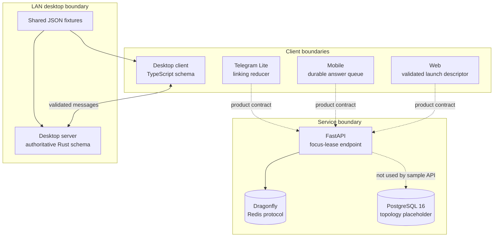

# Showcase architecture

## Purpose and boundary

This repository demonstrates a narrow exam-journey architecture without publishing the Onless production applications. Each module isolates one engineering concern and can be reviewed or tested independently. The local container stack connects only the sample API to Dragonfly; other arrows below describe architectural contracts rather than a complete application deployment.

## Module responsibilities

### Web launch contract

The web slice converts untrusted route or JSON input into a discriminated launch descriptor. Runtime validation rejects unsupported modes, extra fields, malformed identifiers, and incompatible target combinations. Stable route identity keeps canonical parameters distinct from compatibility aliases without delimiter collisions.

### API focus lease

The API slice demonstrates a short-lived, user-scoped lease around one session/question binding. A single Redis Lua operation compares or creates the binding, so concurrent requests cannot both acquire different bindings for the same user. Reopening the same binding does not extend its lifetime. Store failures are represented explicitly at the application boundary.

The runnable endpoint is demonstrative: caller identifiers are supplied directly, authentication and the rest of the product API are intentionally absent, existing binding identifiers are not returned over HTTP, and no production key namespace is used. It binds to localhost in the provided Compose stack and must not be exposed publicly. Store-unavailable results are observability states in this sample, not authorization decisions; a production caller must apply an explicitly reviewed degraded-mode policy.

### Mobile offline ordering

The mobile queue commits an answer through an injected local repository before triggering best-effort synchronization. A background failure cannot reverse the local confirmation. The owner sequencer serializes account transitions, cancels owner-scoped work, and finishes cleanup before activating a replacement account.

### Desktop wire protocol

The Rust schema is authoritative for server/client JSON messages. The TypeScript schema validates the same discriminants, field names, numeric limits, nullability, pairing-code format, and coupled image fields. The test suites at `apps/desktop-protocol/rust/tests/json_fixtures.rs` and `apps/desktop-protocol/typescript/test/json-fixtures.test.ts` both consume `apps/desktop-protocol/fixtures/*.json`, making covered schema drift visible in CI. The fixtures are a focused compatibility check, not generated bindings or a proof of every possible payload.

This slice is a protocol boundary only. It excludes the unfinished LAN applications, networking implementation, privileged device operations, and production discovery configuration.

### Telegram Lite linking

The reducer models onboarding, linking, binding, switching, unlinking, and authoritative synchronization as explicit states and events. Attempt identifiers reject out-of-order proof responses, while monotonically increasing binding generations prevent stale mutations from replacing newer profile state.

## Trust boundaries and invariants

| Boundary | Input treated as untrusted | Enforced invariant |
| --- | --- | --- |
| Web route | Query parameters and decoded JSON | Only known target/mode/field combinations proceed |
| API/cache | HTTP payloads and Redis responses | IDs and TTLs are bounded; lease mutation is atomic |
| Mobile persistence | Account changes and network timing | Durable local commit precedes delivery; owners do not share queued work |
| Desktop transport | JSON from either LAN peer | Strict discriminants and field parity are checked in both languages |
| Telegram linking | Delayed asynchronous results | Attempt and generation ordering reject stale state changes |

The local demonstration is intentionally unauthenticated and must not be exposed as a production service. Production authorization, anti-cheat controls, question selection, payment flows, user data, and operational security are outside this public repository.

## Local deployment

Docker Compose creates two narrowly scoped networks:

- the edge network connects the static frontend and API, whose published ports bind to localhost;
- the internal data network connects the API to Dragonfly and keeps PostgreSQL behind the same local-only demonstration boundary.

Only documented development ports are published to the host. Containers use health checks, non-root execution where supported, and read-only filesystems where practical. Configuration contains unmistakable local placeholders and no production domain or credential.

PostgreSQL starts with the stack to make the persistence boundary visible, but it is deliberately idle: the sample API has no PostgreSQL driver, connection setting, or dependency. Dragonfly is the only stateful service exercised by the HTTP example.

For source origins and normalization boundaries, see [`provenance.md`](provenance.md).
